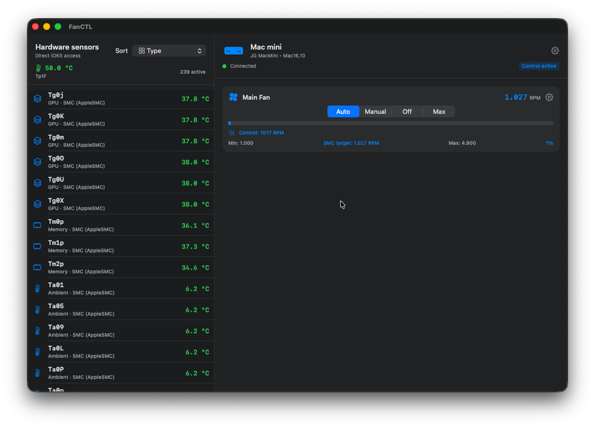

#  FanCTL

Thermal monitoring and fan control for Macs with Apple Silicon.



## What it does

FanCTL is a menu bar app that reads the system's thermal sensors through SMC and IOHID and lets you control the machine's fans manually or automatically, working around the limitations of macOS native fan control.

- **Real-time temperatures**: full sensor list (CPU, GPU, memory, battery and PMU thermal zones…) sortable by hottest, name or category.
- **Max temperature indicator**: icon and color based on the value (green → orange → red → flame).
- **Animated fan in the menu bar**: spins at a speed proportional to the fan's RPM and changes color (green → orange → red) according to speed. The rotation is continuous, with no jumps, even though the data refreshes every second.
- **Fan control** modes:
  - **Auto**: automatic curve that keeps the temperature of your selected sensors between a configurable minimum and maximum.
  - **Manual**: fixed speed in RPM.
  - **Off**: minimum allowed speed.
  - **Max**: maximum allowed speed.
- **Per-fan**: custom RPM limits (min/max), selection of the sensors that drive the control and a speed smoothing filter to avoid abrupt changes.
- **Configurable rescan interval** with stable readings: transient sensor read failures do not make the list jump.
- **Menu bar menu** with quick actions (open the app, stop the daemon, quit).

## Where it's tested

- **Hardware**: Mac mini with **M4 (base)** chip.
- **macOS**: tested on recent macOS versions (Sonoma / Sequoia and later).
- **Architecture**: Apple Silicon (ARM64). Not compatible with Intel Macs.

> On Apple Silicon the `Tp…`/`Te…` prefixes do not represent individual cores but **silicon thermal zones**, and their mapping varies by chip (M1–M5 and variants). FanCTL groups and labels them generically so it never assumes an incorrect mapping.

## Requirements

- Mac with Apple Silicon and macOS 14 or later.
- Fan control requires a **privileged daemon** that performs the SMC writes on your behalf (macOS blocks direct writes to the fan keys).

## Installation

1. Download `FanCTL.dmg`.
2. Drag `FanCTL.app` into the Applications folder.
3. Open the app. On first launch you'll be asked for permission to install the helper daemon.
4. The icon appears in the menu bar once the daemon is active.

## How it works under the hood

- **Sensors**: reads classic SMC keys (`flt` format, little-endian) plus the complementary IOHID interface (Apple Silicon PMU thermal hub).
- **Thermal zones**: the `Tp…` (performance), `Te…` (efficiency) and `Tg…` (GPU) keys are exposed as min–current–max triples/pairs; FanCTL collapses each block to its current value (median of the triple / min of the pair) so the readings match what other tools show.
- **Control**: the SMC writes (`F0Md`, `F0Mn`, `F0Mx`, …) are delegated to a separate privileged daemon that keeps the configuration even if the UI is closed (the app hides to the menu bar and control continues; Cmd+Q restores system control).

## Building from source

```bash
# App (Release)
xcodebuild -project FanCTL.xcodeproj -scheme FanCTL -configuration Release build

# Daemon
sh FanDaemon/build-daemon.sh

# Installation DMG
sh scripts/build_dmg.sh
```

## Project structure

```
FanCTL/
├── FanCTL/                 # App (SwiftUI + AppKit)
│   ├── sensors/            # Sensor reading and parsing
│   │   ├── temperature/    # SMC, IOHID, descriptions, grouping
│   │   ├── fan/            # Fans, control modes
│   │   └── shared/         # SMC client
│   ├── FanDaemonClient.swift # Communication with the daemon
│   └── ContentView.swift   # Main UI
├── FanDaemon/              # Privileged SMC control daemon
├── scripts/                # Packaging scripts
├── icon.png                # App icon
└── ScreenShot.png
```

## Disclaimer

Manually controlling the fans can affect the machine's temperatures. Use this tool at your own risk and keep an active control mode that prevents overheating.
